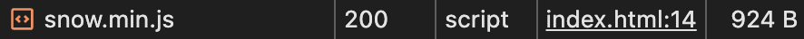

# <ins>Легковесный</ins> генератор снежинок

###### vanilla js

<details>
<summary>
<picture></picture>
</summary>
<!-- Разграничитель -->
  <picture>
    <source media="(prefers-color-scheme: dark)" srcset="https://user-images.githubusercontent.com/84059957/215088292-cf50a16b-422b-43cc-a211-c4169553ca62.png">
    <source media="(prefers-color-scheme: light)" srcset="https://user-images.githubusercontent.com/84059957/210322548-b635bad5-c53d-4209-a73e-fb0adcc437bf.png">
    
  </picture>

  Нечитаемый, но максимальное сжатие:

  <picture></picture>


<!-- Окончание -->
<picture>
    <source media="(prefers-color-scheme: dark)" srcset="https://user-images.githubusercontent.com/84059957/215088776-b06bbe95-42fd-4d78-bcae-70cdbeebbbd3.png">
    <source media="(prefers-color-scheme: light)" srcset="https://user-images.githubusercontent.com/84059957/210319906-4f1e79cb-1a45-4e5c-93e9-ae21e197e0b9.png">
    
  </picture>
</details>

# Подключение

```html
<script src="snow.min.js"></script>
```

# Подробнее

в скрипте комментариев накидал много и максимально подробные в целом

---

###### js uglified via https://www.uglifyjs.net/